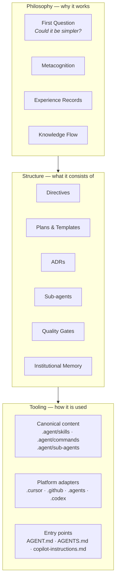
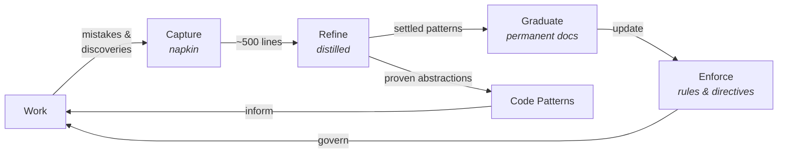
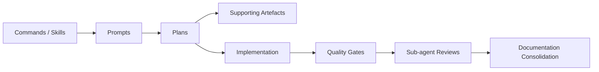

# The Agentic Engineering Practice

The agentic engineering practice is the self-reinforcing system of
principles, structures, agents, and tooling that governs how work happens in
this repository. It creates the conditions for safe, high-quality human-AI
collaboration. The Practice is what produces the site, content model,
structured-data outputs, and supporting tooling — but it is not those
deliverables themselves.

**See also**: For the Practice Core files and their roles, see
[index.md](index.md). For navigable links to this repo's directives, ADRs,
tools, and reference surfaces, see [practice-index.md](../practice-index.md)
— the bridge between the portable Core and the local repo.

## Three Layers

The Practice operates in three layers. Each builds on the one below.

### Philosophy

The principles and learning mechanisms. The First Question ("could it be
simpler?"), metacognition (`.agent/directives/metacognition.md`), experience
records (`.agent/experience/`), and the knowledge flow. **Architectural
enforcement** is a core philosophical commitment: preferring physical
constraints (lint rules, validators, gate wiring, and surface contracts) over
human vigilance. This layer defines _why_ the Practice works.

### Structure

The organisational patterns. Directives (`.agent/directives/`), plans
(`.agent/plans/`), ADRs, sub-agent prompt architecture, quality gates, and
institutional memory (`.agent/memory/`). **Cross-agent standardisation**
(AGENTS.md, agent skills, Copilot entry instructions, and Codex adapters) is
an evolving implementation direction to keep the Practice portable and
platform-aware without creating multiple sources of truth. This layer defines
_what_ the Practice consists of.

### Tooling

Platform-specific implementations follow a canonical-first model: substantive
content lives in `.agent/`; thin adapters in platform directories point back
to it. In Codex, `.agents/skills/` is the portable skill/command layer and
`.codex/` holds project reviewer config. Repo-local platform config such as
`.cursor/settings.json`, `.github/copilot-instructions.md`, and
`.codex/config.toml` is tracked infrastructure, not incidental clutter. When
multiple platforms exist, keep the exact supported and unsupported mappings in
`.agent/reference/cross-platform-agent-surface-matrix.md` and validate wrapper
parity with `pnpm portability:check`. This layer defines _how_ the Practice is
used in a specific environment.

## The Knowledge Flow

The knowledge flow is the Practice's central mechanism. It converts raw
experience into settled knowledge through a progression of stages, each
serving a broader audience and demanding a stricter bar for entry.

### The Cycle

### Three Audiences

Each stage exists because it serves a different audience. The progression from
capture to graduation is a progression from narrow to broad.

| Stage        | Artefact                                | Audience                                | Fitness governor                                       |
| ------------ | --------------------------------------- | --------------------------------------- | ------------------------------------------------------ |
| **Capture**  | Napkin                                  | Current session                         | ~500 lines → distillation                              |
| **Refine**   | Distilled learnings                     | Future agents                           | ~200 lines → extraction to permanent docs              |
| **Graduate** | ADRs, governance docs, READMEs, TSDoc   | Everyone — humans and agents            | Per-file fitness frontmatter → split by responsibility |
| **Enforce**  | Rules, directives, always-applied rules | All agents, automatically               | `fitness_line_target` / `fitness_line_limit`           |
| **Inform**   | Code patterns                           | Engineers facing a recognised situation | Barrier: broadly applicable, proven, recurring, stable |

Not everything in the napkin survives distillation, and not everything
distilled graduates to permanent documentation. Each transition raises the
bar. The `/jc-consolidate-docs` command drives the graduation step — it checks
which distilled entries have settled into permanent Practice artefacts, moves
them to their discoverable home, and reconciles live doc truth across
frontmatter status, narrative status, next-step sections, and current-state or
audit notes.

### Fitness Functions

Every stage has a governor that prevents unbounded growth. Without these, the
knowledge flow simply moves the accumulation problem downstream.

- **Napkin** → ~500 lines triggers distillation: extract high-signal patterns,
  archive the rest
- **Distilled** → target <200 lines; the primary reduction mechanism is
  extracting settled entries to permanent docs, not compression
- **Permanent docs** → governed files carry four fitness fields:
  `fitness_line_target` (soft), `fitness_line_limit` (hard),
  `fitness_char_limit` (hard), and `fitness_line_length` (hard, always 100).
  Files may also carry `split_strategy` to describe the preferred extraction
  path when they grow
- **Practice Core** → the trinity files carry the same four fields, while
  provenance history lives in `provenance.yml` outside the content budget

### Feedback Properties

The knowledge flow is stabilised by interlocking feedback. Quality gates,
sub-agent reviews, and the learning loop detect entropy and convert it into
corrective knowledge (negative feedback). Agents improve agents, the
self-teaching property improves documentation, and consolidation extracts
common threads into simpler structures (positive feedback). These operate at
different timescales — gates within seconds, learning within sessions,
consolidation across sessions — but all keep the Practice aligned with
reality.

### The Transmission Dimension

The knowledge flow is itself part of the Practice, and the Practice travels
via [plasmid exchange](#plasmid-exchange). The knowledge flow pattern is
therefore self-replicating: a receiving repo inherits not just current rules
but the mechanism that produced them. Each repo's learning loop runs locally,
producing learnings shaped by local context. When the Practice returns to its
origin via the Practice Box, it may carry patterns that the origin's own loop
had not surfaced — different work, different mistakes, different discoveries.

### Artefact Locations

- **Napkin** — `.agent/memory/napkin.md` — written continuously during every
  session
- **Distilled** — `.agent/memory/distilled.md` — curated rulebook, read at
  session start
- **Code patterns** — `.agent/memory/code-patterns/` — abstract proven
  patterns
- **Rules** — `.agent/directives/rules.md` (authoritative policy) plus native
  platform triggers such as `.cursor/rules/*.mdc`
- **Experience** — `.agent/experience/` — qualitative records of shifts in
  understanding

## The Review System

Specialist sub-agents provide targeted review after non-trivial changes. The
`invoke-reviewers` rule (canonically `.agent/rules/invoke-reviewers.md`) is
the authoritative source for the roster, invocation matrix, timing tiers, and
triage checklist. The `.agent/directives/AGENT.md` "Available Sub-agents"
section lists the installed reviewers. In Codex, reviewer roles are
registered through `.codex/config.toml` and thin `.codex/agents/*.toml`
adapters rather than modelled as skills.

Sub-agent prompts follow a three-layer composition architecture: components,
templates, and wrappers.

## The Workflow

Work flows through a predictable sequence: commands and skills structure the
work, prompts and plans provide execution context, and quality gates validate
the output.

- **Commands** (`.agent/commands/`, with platform adapters in
  `.cursor/commands/` and `.agents/skills/jc-*/`) — named workflows that
  initiate structured work
- **Skills** (`.agent/skills/`) — reusable workflows and capabilities such as
  `start-right`, `quality-gates`, `napkin`, `distillation`, and domain
  guidance like `pkg`
- **Prompts** (`.agent/prompts/`) — reusable playbooks that provide domain
  context, handover structure, or execution guidance beyond the generic session
  opener
- **Plans** (`.agent/plans/`) — executable work plans with a local hierarchy:
  1. **Repo roadmap** — `roadmap.md` for cross-stream intent
  2. **Primary active plan** — `.agent/plans/active/<plan-name>.md`, with
     `active/README.md` naming the current execution focus
  3. **Supporting current plans** — `.agent/plans/current/` for related
     workstreams still in play
  4. **Archived and research plans** — `complete/`, `icebox/`, and `research/`
     for preserved context, discoveries, or deferred work
  5. **Value traceability** — every non-trivial plan states the outcome sought,
     the impact it should create, and the mechanism by which that impact
     creates value
  6. **Documentation propagation** — before phase closure, propagate settled
     outcomes from plans into permanent docs and apply the consolidate-docs
     command
- **Quality gates** — see `.agent/directives/rules.md` and the local
  quality-gate commands. Blocking verification is repo-defined and may be
  split across `pnpm check`, `pnpm test:e2e`, visual regression proof, and
  Practice fitness checks when those surfaces are in play.

## Artefact Map

| Location                                      | What lives there                                                                                           |
| --------------------------------------------- | ---------------------------------------------------------------------------------------------------------- |
| `.agent/directives/`                          | Principles, rules, and operational directives                                                              |
| `.agent/practice-core/`                       | Practice Core files: plasmid trinity, entry points, changelog, provenance, and Practice Box                |
| `.agent/plans/`                               | Work planning — active, current, complete, icebox, and research surfaces                                   |
| `.agent/memory/`                              | Institutional memory — napkin, distilled learnings, and code patterns                                      |
| `.agent/experience/`                          | Experiential records across sessions                                                                       |
| `.agent/prompts/`                             | Reusable prompt playbooks                                                                                  |
| `.agent/sub-agents/`                          | Reviewer prompt architecture (components and templates)                                                    |
| `.agent/skills/`                              | Canonical skills (platform-agnostic)                                                                       |
| `.agent/commands/`                            | Canonical commands (platform-agnostic)                                                                     |
| `.agent/research/`                            | Research documents and analysis                                                                            |
| `.agent/reference/`                           | Stable supporting reference material, including local surface contracts                                    |
| `.cursor/`, `.github/`, `.agents/`, `.codex/` | Platform adapters and project config referencing canonical content                                         |
| Repo's ADR directory                          | Permanent architectural decision records (path varies by repo; see [practice-index](../practice-index.md)) |

## Plasmid Exchange

The Practice is not confined to a single repo. The portable part of it travels
as the Practice Core: a package of seven files in `.agent/practice-core/`
consisting of the plasmid trinity — this file (the **what**),
[practice-lineage.md](practice-lineage.md) (the **why**), and
[practice-bootstrap.md](practice-bootstrap.md) (the **how**) — the entry
points [README.md](README.md) (for humans) and [index.md](index.md) (for
agents) — the changelog ([CHANGELOG.md](CHANGELOG.md)) — and the provenance
file ([provenance.yml](provenance.yml)). The trinity files evolve through real
work; the entry points provide orientation; the changelog records what changed;
the provenance file tracks every repo that has shaped each trinity file. Each
repo carries its own Practice instance — there is no hierarchy.

The trinity files carry YAML frontmatter with a `provenance` pointer (to
`provenance.yml`) and four fitness thresholds:
`fitness_line_target` (soft line ceiling), `fitness_line_limit` (hard line
ceiling), `fitness_char_limit` (hard character ceiling), and
`fitness_line_length` (hard prose line width, always 100). All measure content
only — frontmatter is excluded. The provenance file always travels with the
Practice Core package.

The mechanism is documented in [practice-lineage.md](practice-lineage.md),
which serves as both the reference for how exchange works and the source
template for outbound propagation. Optional exchange context may travel
separately in `.agent/practice-context/`, with sender-maintained `outgoing/`
material copied into receiver-side `incoming/` when needed.

### The Practice Box

`.agent/practice-core/incoming/` is the canonical location for incoming
Practice Core files. It is normally empty. When files arrive:

- **At session start** (via the `start-right` skill), agents alert the user.
- **At consolidation** (via `/jc-consolidate-docs` step 6), agents perform the
  full integration flow: check the provenance chain, compare against the full
  local Practice system (not just `practice.md` — also rules, skills,
  commands, prompts, directives, and any repo-facing docs that describe the
  same tooling), apply the three-part bar, propose specific changes, and clear
  the box after integration.

### Meta-Principles

Principles about the Practice itself, discovered through propagation and
evolution. These sit above domain-specific rules — they govern how the
Practice works, not what the product code should look like.

- **Separate universal from domain-specific at the file level.** When rules
  about TDD live in the same file as rules about a specific schema,
  portability requires line-by-line editing.
- **If a behaviour must be automatic, it needs a rule, not just a skill.**
  Skills are documentation — they depend on being discovered and invoked.
  Always-applied rules fire on every interaction. The learning loop's capture
  stage (napkin) must be enforced by a rule to be genuinely always-on.
- **Plasmids need a provenance chain, not just an origin.** A file that only
  records where it was created will be dismissed by its origin repo as "already
  mine." Provenance entry IDs are UUIDs, while chain order and `date` carry
  chronology; they still cannot replace detailed content comparison.
- **Practice Core files must be self-contained.** No navigable markdown links
  to files outside `practice-core/`, except to `../practice-index.md` — the
  one bridge file that the Core specifies and hydration creates.
- **Supported and unsupported agent surfaces should be explicit.** When a repo
  spans multiple agent platforms, document what is real and what is absent.
  Missing files should not be asked to carry implicit meaning.

The full set of Learned Principles is maintained in
[practice-lineage.md](practice-lineage.md) §Learned Principles.

## The Self-Teaching Property

The Practice is designed to be discoverable through use. `AGENT.md` links to
`rules.md`, which references `testing-strategy.md`. Commands invoke skills,
skills and prompts point to plans, and plans may draw on supporting artefacts
when needed. Sub-agents review work against the same rules that guided its
creation. The napkin captures what went wrong, distillation extracts rules,
and the rules prevent repetition.

If you are new to this repository, start with `.agent/directives/AGENT.md`.
Follow the links. The Practice will teach itself.

## Sustainability and Scaling

The Practice can span many files. This volume is managed, not accidental —
each layer generates artefacts with distinct lifecycles (directives are
stable, plans are ephemeral, generated outputs are rebuilt on demand). Three
mechanisms keep volume manageable: the knowledge flow's fitness functions, the
consolidate-docs command (which graduates plan content to permanent docs, then
archives or reclassifies the plan), and sub-agent prompt consolidation (which
extracts common review patterns into shared templates).

Intentional repetition is a conscious trade-off: some core ideas appear in
many files so that any contributor encounters them early. DRY matters for
code; discoverability matters for onboarding. The risk is formulation drift,
mitigated by consolidation and by treating canonical files and thin wrappers
as separate responsibilities.

The Practice should be restructured if consolidation cannot keep pace with file
creation, the distillation cycle takes longer than one session, semantic search
for a core concept returns too many equally weighted hits, or agents
consistently exhaust context windows reading overlapping material.
