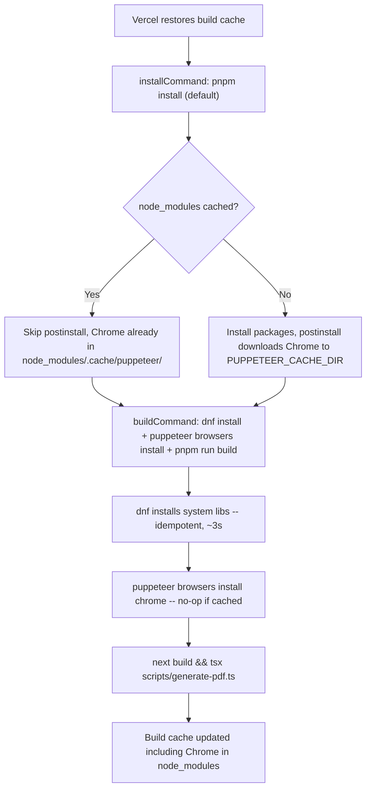

# Fix Vercel build pipeline: restore idiomatic caching

## Problem

Two compounding issues break Vercel builds after the first successful deployment:

1. **Subverted `installCommand**`--`dnf install` runs system package installation inside Vercel's install step, which is designed solely for the Node package manager. This prevents Vercel from reasoning about or caching the install step correctly.
2. **Chrome binary not cached** -- Puppeteer downloads Chrome to `/vercel/.cache/puppeteer/`, which is outside Vercel's build cache scope (`node_modules/**` and `.next/**`). When `pnpm install` reports "Already up to date" (cache hit), the postinstall script never runs, Chrome is absent, and the build fails.

## Solution

Move all non-npm concerns out of `installCommand` and into `buildCommand`. Set `PUPPETEER_CACHE_DIR` so Chrome is stored inside `node_modules/` where it IS cached.



## Changes

### 1. Update [vercel.json](vercel.json)

Remove the `installCommand` override entirely. Add a `buildCommand` that prepends system deps and Chrome installation before the normal build:

```json
{
  "$schema": "https://openapi.vercel.sh/vercel.json",
  "buildCommand": "dnf install -y nss mesa-libgbm libdrm libxkbcommon libXdamage && npx puppeteer browsers install chrome && pnpm run build"
}
```

### 2. Set `PUPPETEER_CACHE_DIR` environment variable in Vercel

Add `PUPPETEER_CACHE_DIR=./node_modules/.cache/puppeteer` as an environment variable in the Vercel project settings (all environments). This ensures:

- Puppeteer's postinstall stores Chrome inside `node_modules/`, which Vercel caches
- The explicit `puppeteer browsers install chrome` in the build step checks the same directory
- On cache hit: Chrome is already there, the command is a no-op
- On cache miss: Chrome is downloaded (~15s), then cached for next time

### 3. Update [postcss.config.mjs](postcss.config.mjs) -- already done

The `.ts` to `.mjs` rename from earlier in this session fixes the CSS processing issue. This is already on disk but needs to be committed.

### 4. Update ADR-001 [docs/architecture/decision-records/001-build-time-pdf-generation.md](docs/architecture/decision-records/001-build-time-pdf-generation.md)

Replace the `installCommand` section to document the new `buildCommand` approach, explaining:

- Why `installCommand` was abandoned (caching invariant violation)
- Why `buildCommand` is correct (system deps + Chrome are build concerns, not install concerns)
- The role of `PUPPETEER_CACHE_DIR` in making Chrome cacheable

Add a **"Future alternative: Cloudflare Browser Rendering"** section documenting:

- If `dnf` on Vercel's build image proves unreliable (e.g. Vercel changes OS or removes root access), the fallback is a Cloudflare Worker with a Browser Rendering binding (see `.agent/research/cloudflare-pdf-render-service.md`)
- This would require splitting the repo into a monorepo (e.g. Turborepo) with two workspaces: the Next.js site and the PDF render worker
- The site is already proxied through Cloudflare, which opens up on-demand rendering: a Cloudflare Worker in the request path could generate the PDF on first request (or via a deploy hook), removing the need for Vercel to call Cloudflare -- Cloudflare is already in the loop
- This is documented as a contingency, not a current plan -- the `buildCommand` approach is simpler and sufficient today

### 5. Commit, push, and verify

- Commit the `vercel.json`, `postcss.config.mjs`, and ADR changes
- Push to `main`
- Monitor the Vercel build via the Vercel MCP tools
- Verify both issues are resolved: CSS renders correctly AND PDF generates successfully
- Verify a second push (no dependency changes) also succeeds -- confirming the caching fix

## What does NOT change

- [package.json](package.json) `build` script stays as `next build && tsx scripts/generate-pdf.ts`
- [scripts/generate-pdf.ts](scripts/generate-pdf.ts) -- no changes
- [lib/pdf-config.ts](lib/pdf-config.ts) -- no changes
- [app/cv/pdf/route.ts](app/cv/pdf/route.ts) -- no changes
- The PDF keying mechanism (commit SHA) continues to work identically
